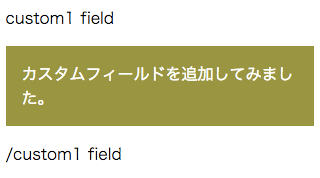
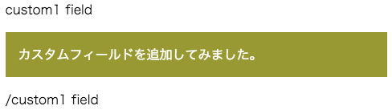

このモジュールは、開発用に作成したカスタムフィールドを使用したモジュールの実装例です。

## コーディング例

```
<div>
    <p>custom1 field</p>
{&{"input":{"type":"custom1","name":"main","description":"これはカスタムフィールドです。\n\nカスタムフィールドは、broccoli-html-editor の初期化時に設定して、追加することができます。"}}&}
    <p>/custom1 field</p>
</div>
```

## サンプルイメージ

### サンプルイメージ1



### サンプルイメージ2



## README 表現サンプル

### h3 表現サンプル

#### h4 表現サンプル

- ul/li サンプル
- ul/li サンプル
    - ul/li サンプル
        - ul/li サンプル
- ul/li サンプル

段落テキストサンプル。

1. ol/li サンプル
2. ol/li サンプル
3. ol/li サンプル
4. ol/li サンプル
